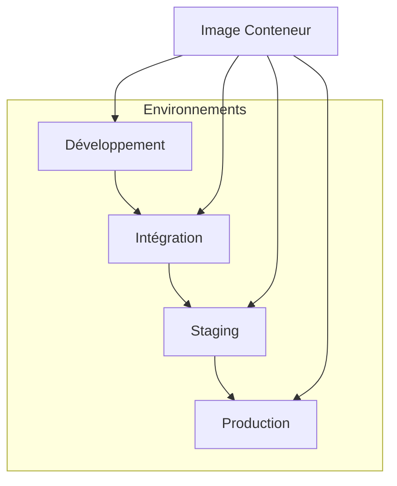
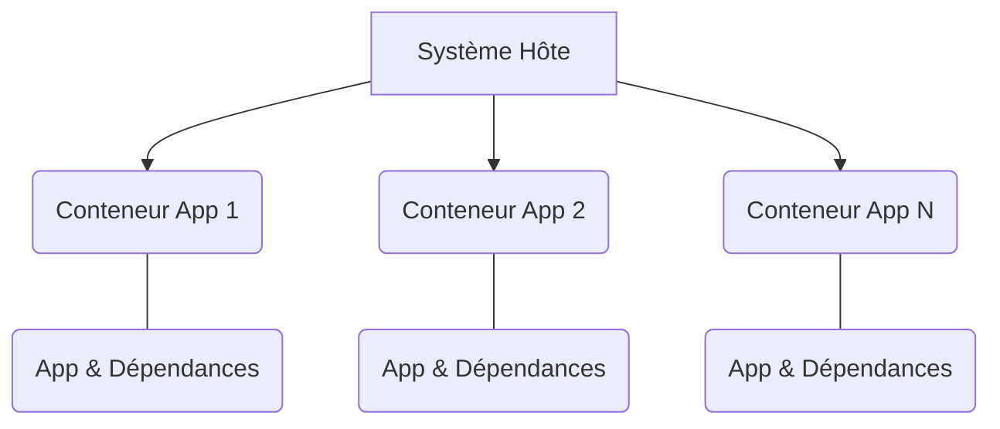
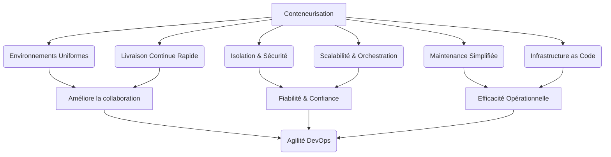

Voici la présentation de 6 slides sur les avantages de la conteneurisation pour le DevOps, conçue pour être pédagogique et engageante.

---

## Avantages de la Conteneurisation pour le DevOps

La conteneurisation, popularisée par Docker, a profondément remodelé le DevOps. Elle offre un moyen léger, standardisé et portable pour développer, tester et déployer des applications.

**Elle permet de :**
*   Développer des applications dans des environnements cohérents.
*   Accélérer la livraison et le déploiement.
*   Renforcer l'isolation et la sécurité.
*   Faciliter la scalabilité et l'orchestration.
*   Simplifier la maintenance et les mises à jour.
*   Mettre en œuvre l'Infrastructure as Code.

---

## 1. Environnements Cohérents et Livraison Accélérée

**Uniformité des environnements (Du dev à la prod)**
*   Un conteneur embarque l’application avec toutes ses dépendances, bibliothèques et configurations.
*   Il garantit un fonctionnement identique, quel que soit l’environnement (développeur, intégration, staging ou production).
*   **Exemple :** Une application Node.js s'exécute dans le même environnement partout, évitant le « ça marche chez moi ».

**Rapidité et efficacité dans la livraison continue**
*   Les conteneurs démarrent rapidement (quelques secondes) en exploitant le noyau hôte.
*   Cela réduit significativement le temps de build et de déploiement.
*   **Exemple :** Un pipeline CI/CD lance des tests automatisés dans un conteneur récent sans surcharge de démarrage de VM, accélérant le feedback aux développeurs.

**Graphique explicatif : Uniformité des environnements**

*(Une seule "Image Conteneur" est déployée et fonctionne de manière identique dans tous les "Environnements", garantissant une cohérence parfaite.)*

---

## 2. Sécurité Renforcée et Scalabilité Élastique

**Isolation et sécurité**
*   Les conteneurs isolent les applications entre elles et du système hôte.
*   Ils utilisent les `namespaces` Linux et `cgroups`.
*   Cela protège contre les conflits de dépendances et limite les risques de propagation de failles.

**Scalabilité et orchestration facilitées**
*   Légers et rapides à démarrer, les conteneurs permettent d’adapter dynamiquement le nombre d’instances d’une application selon la charge.
*   Les orchestrateurs comme Kubernetes automatisent le scaling, la réparation des défaillances et l'équilibrage de charge.
*   **Exemple :** Un service web conteneurisé via Kubernetes peut créer automatiquement plus de pods conteneurs en cas de forte demande, sans intervention manuelle.

**Graphique explicatif : Isolation des conteneurs**

*(Les conteneurs (App 1, App 2, App N) sont isolés les uns des autres et du "Système Hôte", contenant chacun leur "App & Dépendances" sans interférer.)*

---

## 3. Maintenance Simplifiée & Infrastructure as Code

**Simplification de la maintenance et mise à jour**
*   Grâce aux images versionnées, il est simple de déployer une nouvelle version d’une application.
*   Possibilité de revenir en arrière (rollback) si besoin.
*   Facilite les déploiements progressifs et la gestion des versions.

**Environnement "Infrastructure as Code" (IaC)**
*   Les fichiers `Dockerfile` et `Docker Compose` décrivent précisément l'environnement d’exécution sous forme de code.
*   Cela rend l’infrastructure reproductible, traçable et partageable.

**Tableau récapitulatif : Avantages clés**

| Caractéristique | Impact sur DevOps |
| :-------------- | :---------------- |
| **Images Versionnées** | Déploiements fiables, rollbacks facilités, gestion des versions. |
| **Dockerfiles/Compose** | Infrastructure reproductible, collaboration améliorée, auditabilité. |
| **Légèreté & Démarrage rapide** | Réduction des temps d'arrêt, mises à jour plus fréquentes. |
| **Standardisation** | Moins d'erreurs dues aux incohérences, apprentissage facilité. |

---

## 4. La Conteneurisation en Action : Synthèse des Bénéfices DevOps

**Diagramme récapitulatif des 6 avantages clés**

*(Le déploiement de la "Conteneurisation" entraîne les 6 avantages principaux, qui à leur tour renforcent la "Collaboration", la "Fiabilité" et l'"Efficacité Opérationnelle", culminant dans l'"Agilité DevOps".)*

---

## 5. La Conteneurisation : Moteur de l'Agilité DevOps

**Ce qu'il faut retenir**
*   La conteneurisation fusionne développement et exploitation dans un cycle fluide.
*   Elle repose sur des environnements reproductibles, des déploiements rapides et une infrastructure simplifiée à gérer.
*   Ces atouts en font un outil central du mouvement DevOps, favorisant la collaboration, la qualité et l’agilité des équipes.

**Sources utilisées**
*   Docker, *What is Docker?* : `https://www.docker.com/resources/what-container`
*   Red Hat, *The value of containers for DevOps teams* : `https://www.redhat.com/en/topics/devops/containers-for-devops`
*   CNCF, *Understanding Containers* : `https://www.cncf.io/blog/2020/10/21/understanding-containers/`
*   IBM Cloud Education, *Why use containers?* : `https://www.ibm.com/cloud/learn/containers`
